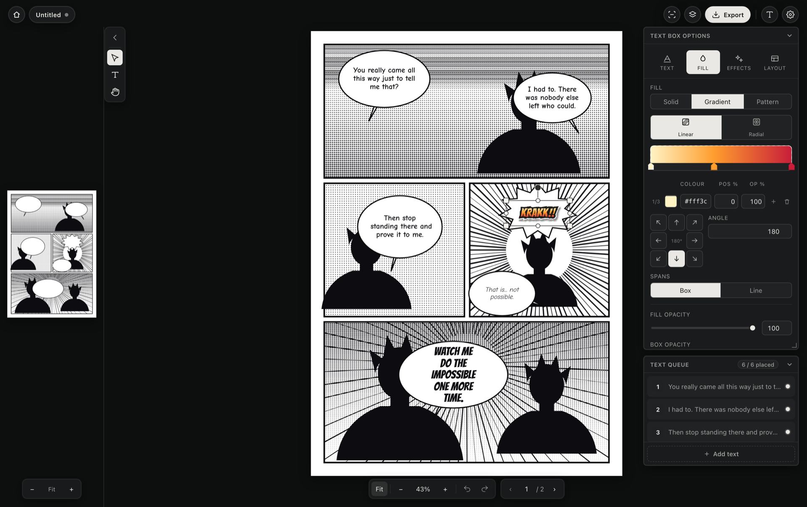

<div align="center">

<pre>
█▀▄▀█ ▄▀█ █▄ █ █▀▀ ▄▀█   ▀█▀ █▄█ █▀█ █▀▀ █▀ █▀▀ ▀█▀ ▀█▀ █▀▀ █▀█
█ ▀ █ █▀█ █ ▀█ █▄█ █▀█    █   █  █▀▀ ██▄ ▄█ ██▄  █   █  ██▄ █▀▄

        lettering for scanlation, without Photoshop
</pre>

[](#install)
[](https://tauri.app)
[](https://svelte.dev)
[](https://typesetter.komiq.cc)
[](LICENSE.md)
[](https://discord.gg/vhuYWbZNX5)
[](https://ko-fi.com/komiq)

</div>

A desktop app that puts translated lettering into speech balloons. Light on
memory, works over hundreds of pages, no Photoshop needed.

**[Download](https://typesetter.komiq.cc)** · **[User guide (HOWTO)](HOWTO.md)**

> Public beta. In daily use, but expect rough edges.



## What it does

- Click a bubble, get a text box fitted to its shape
- Shaped line breaking with hyphenation, tuned for balloons
- Bubble and text detection (ONNX, in-process), optional manga-ocr
- Gradient, pattern and roughened text fills with stacked strokes and shadows
- Bulk restyle by tag, across a page or a whole chapter
- Autosave with undo that survives a relaunch
- Export to PNG, JPG, WebP, JSON or PSD with editable type layers
- Paged manga and longstrip webtoon projects
- `.mtchapter` packages to hand a chapter (pages, fonts, tags) to someone else
- Rebindable shortcuts, signed auto-updates

## Install

Grab the installer from **<https://typesetter.komiq.cc>**.

- macOS (Apple Silicon): open the `.dmg`, drag the app to Applications. The
  bundle is not notarised yet, so first launch needs right-click > **Open**.
- Windows: run the setup `.exe`.

Updates arrive in-app and are signature-verified.

## Build from source

Requires [Node](https://nodejs.org) 20+ and a [Rust toolchain](https://rustup.rs)
(see the [Tauri v2 prerequisites](https://v2.tauri.app/start/prerequisites/)).

```sh
git clone https://github.com/k-omiq/manga-typesetter.git
cd manga-typesetter
npm install

npm run tauri dev     # run it
npm run tauri build   # bundle in src-tauri/target/release/bundle
npm test              # vitest
```

Detection models download on first use and are cached under your home
directory; nothing ships in the bundle.

## Built with

[Svelte 5](https://svelte.dev) · [Vite](https://vite.dev) ·
[Tauri 2](https://tauri.app) · [ag-psd](https://github.com/Agamnentzar/ag-psd) ·
[hypher](https://github.com/bramstein/hypher) ·
[ONNX Runtime](https://onnxruntime.ai) via [`ort`](https://ort.pyke.io)

Detection models from
[deepghs/manga109_yolo](https://huggingface.co/deepghs/manga109_yolo),
[zyddnys/manga-image-translator](https://github.com/zyddnys/manga-image-translator)
and [kha-white/manga-ocr](https://github.com/kha-white/manga-ocr).

## License

[MIT](LICENSE.md) © 2026 k-omiq
